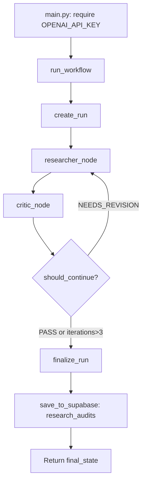
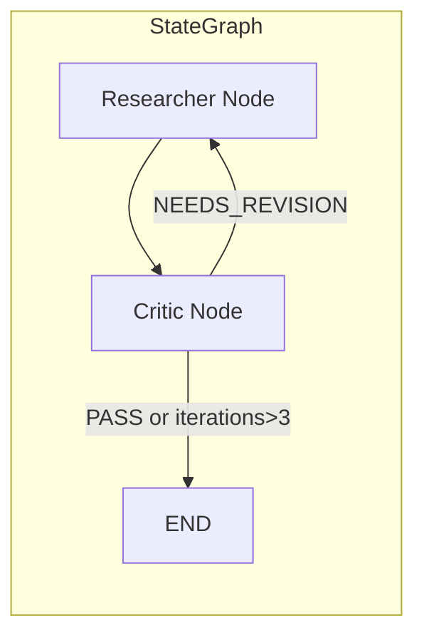

# Research Auditor — Architecture

This document describes the architecture of the Research Auditor multi-agent app after structural cleanup.

---

## 1. Purpose of the App

**Research Auditor** is a multi-agent system that performs industrial research audits. Given raw technical text (e.g., project documentation, specifications), it:

- **Extracts** structured technical findings from the text
- **Validates** those findings against the source material
- **Iterates** until the findings pass quality gates or a limit is reached
- **Persists** the final audit results for review and traceability

The app is designed for reproducibility, observability, and deployment in production pipelines (e.g., via Railway, GHCR).

---

## 2. Function

The app runs a **Researcher–Critic loop**:

1. **Researcher** agent ingests raw text and produces structured `ResearchOutput` (title, key findings, confidence score, supporting quotes).
2. **Critic** agent reviews the research output and produces `AuditFeedback` (verdict: PASS / FAIL / NEEDS_REVISION, critique points, suggested focus).
3. If the verdict is **PASS** or iterations reach **3**, the loop stops; otherwise the **Researcher** runs again with the critic’s feedback (via `suggested_focus`).
4. The final state is persisted to Supabase (audit summary and full run/turn trace).

**Entrypoints:**

- **CLI** (`app.main`): Runs the full workflow with hardcoded sample input; requires `OPENAI_API_KEY`.
- **HTTP** (`app.entrypoints.http`): Serves health checks and a static message; used by deployment. No workflow API yet.

---

## 3. Main Data Structures

### Agent Outputs (Pydantic Models)

| Model           | Source  | Purpose                                                                 |
|----------------|---------|-------------------------------------------------------------------------|
| `ResearchOutput` | Researcher | Title, key findings (≥3), confidence score (0–1), supporting quotes   |
| `AuditFeedback`  | Critic    | Verdict (PASS/FAIL/NEEDS_REVISION), critique points, suggested focus |

### Workflow State (TypedDict)

| Type           | Purpose                                                                 |
|----------------|-------------------------------------------------------------------------|
| `AgentState`   | Shared state: `raw_input`, `research`, `feedback`, `iterations`; optionally `run_id`, `step` |
| `FinalState`   | Output passed to persistence: `research`, `feedback`, `iterations`      |

### Persistence (Protocol)

| Type       | Purpose                                                                 |
|------------|-------------------------------------------------------------------------|
| `RunRepo`  | Protocol for run/turn persistence: `create_run`, `append_turn`, `finalize_run` |

Implementations: `SupabaseRepo` (runs/turns tables), `NullRepo` (no-op for tests).

---

## 4. Main Workflows

### CLI Workflow (End-to-End)



### LangGraph Orchestration



The **orchestrator** is implemented as a LangGraph `StateGraph`:

- Entry point: **Researcher**
- Edge: Researcher → Critic
- Conditional edge from Critic: to END (if PASS or iterations > 3) or back to Researcher (if NEEDS_REVISION)

---

## 5. How Orchestrator, Researcher, and Critic Communicate

### Communication Model

They communicate through **shared state**, not direct calls:

1. **Orchestrator** (LangGraph) holds `AgentState` and invokes nodes.
2. **Researcher node** receives `state` → calls `run_research(state['raw_input'])` → returns `{ research, iterations }` merged into state.
3. **Critic node** receives `state` → calls `run_audit(state['research'])` → returns `{ feedback }` merged into state.
4. **Conditional routing** (`should_continue`) reads `state['feedback'].verdict` and `state['iterations']` to decide END or loop back to Researcher.

### Data Flow (Conceptual)

```
raw_input (str)
    → run_research()
    → ResearchOutput
    → run_audit()
    → AuditFeedback
    → should_continue()
    → (loop or end)
```

The **Researcher** and **Critic** agents are PydanticAI agents with schema-bound outputs; the orchestrator only passes typed objects between nodes.

---

## 6. Role of Logfire

**Logfire** (Pydantic ecosystem) provides observability for the multi-agent run.

### Where It Is Hooked Up

- **Setup** in `main.py` (before workflow): `logfire.configure()` and `logfire.instrument_pydantic_ai()` when `LOGFIRE_TOKEN` is set.
- **Instrumentation**: `instrument_pydantic_ai()` auto-instruments PydanticAI agents so their runs, traces, and outputs are sent to Logfire.

### Data Path

```
main.py (startup)
    → logfire.configure()
    → logfire.instrument_pydantic_ai()
        → PydanticAI agents (Researcher, Critic) are instrumented
        → Each agent.run() produces spans/traces sent to Logfire

Researcher / Critic agent.run()
    → Logfire captures: input, output, latency, model calls
```

If `LOGFIRE_TOKEN` is not set, instrumentation is skipped and the app runs without observability.

---

## 7. Role of Supabase Tables

Supabase is used for **audit persistence**. There are two distinct roles.

### Tables and Semantics

| Table           | Semantic Role                                                                 |
|----------------|-------------------------------------------------------------------------------|
| `runs`         | One row per workflow execution: topic, status (running/completed/failed), timestamps, final_output, error |
| `turns`        | One row per agent invocation: run_id, step, agent (researcher/critic), input, output, ok, error |
| `research_audits` | One row per completed audit: title, findings, verdict, critique, iterations (summary for downstream use) |

### Data Path

**Run/Turn Persistence (Orchestrator):**

1. `run_workflow()` calls `repo.create_run(topic)` → insert into `runs`, get `run_id`.
2. Each **researcher_node** and **critic_node** call `repo.append_turn(run_id, step, agent, input, output, ok, error)` → insert into `turns`.
3. On success or failure, `repo.finalize_run(run_id, status, final_output=..., error=...)` → update `runs`.

**Audit Summary (main.py):**

1. After `run_workflow()` returns `final_state`, `save_to_supabase(final_state)` maps it to `research_audits` and inserts one row.
2. This provides a compact summary (title, findings, verdict, critique) for dashboards, reports, or downstream consumers.

**Relationship:**

- `runs` + `turns`: full execution trace (debugging, replay, analytics).
- `research_audits`: distilled output for stakeholders.

If Supabase is not configured, `NullRepo` is used (no run/turn writes) and `save_to_supabase` is a no-op.

---

## Appendix: Entrypoint Summary

| Entrypoint            | Module                    | Purpose                              |
|-----------------------|---------------------------|--------------------------------------|
| CLI (workflow)        | `app.main`                | Run full workflow, persist to Supabase |
| HTTP (deployment)     | `app.entrypoints.http`    | Health checks, static message        |
| Orchestrator          | `app.orchestrator.run`    | LangGraph workflow, `run_workflow()` |
| Researcher            | `app.agents.researcher`   | `run_research()` → `ResearchOutput`  |
| Critic                | `app.agents.critic`       | `run_audit()` → `AuditFeedback`      |
