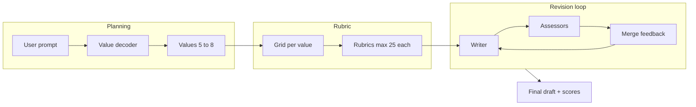

# Smart Writer — Architecture

This app was bootstrapped from `research-auditor` with the same layout: **PydanticAI** agents, **LangGraph** orchestration, optional **Supabase** persistence, **FastAPI** HTTP entrypoint, **Logfire** observability.

---

## Purpose

**Smart Writer**

1. Takes a prompt from the user (web UI) that explains what writing is required.
2. Uses a **value-decoder** agent to infer which **task-specific** qualities matter (e.g. humor for stand-up, persuasion for a nonprofit grant). **Domain** criteria are bounded between **MIN** and **MAX** (defaults **5** and **8**) for **total** domain rows (**task-derived** from the decoder, plus any **canonical library** matches when that feature is enabled—see `docs/design-canonical-value-rubric-library.md` §5.3.1). **Craft** / hygiene values are added separately and do not consume those MIN/MAX slots.
3. Uses a **value-dimension-grid** step: for each value, define **five assessment dimensions** and a **1–5 score** per dimension, yielding a **per-value rubric** with a maximum total of **25** (5 × 5).
4. Instantiates **N value-assessor** agents (typically one specialized run per value, sharing the same rubric schema).
5. Creates one **writer** agent and a **revision loop**: the writer produces a draft from the prompt plus system constraints (defaults + optional overrides); each assessor scores the draft on its value using the grid and returns **keep** / **change** feedback for the writer.
6. The writer produces the next draft by synthesizing all assessor feedback.
7. The loop continues until **max iterations** (default **10**) or until **aggregate score improvement** falls below a meaningful threshold (plateau detection).

---

## Architecture details

### Review of the purpose

The purpose defines a **values-first, rubric-grounded writing loop**: quality is not a single vague “be better” signal but a **decomposed** set of criteria (values → dimensions → scores) with **explicit convergence** (iteration cap + plateau). That aligns well with **schema-first agents** (Pydantic outputs), **observable multi-step workflows** (LangGraph + Logfire), and **auditable runs** (Supabase run/turn traces).

Minor clarifications to lock in before implementation:

- **N assessors vs N values**: N should match the number of values (one assessor role per value), unless you later collapse values for cost control.
- **“Aggregate score”**: define as a deterministic function of per-value totals (e.g. sum of 0–25 scores, or normalized average) so stopping rules are testable and stable across models.

### Key ideas

| Idea | Role |
|------|------|
| **Value decoder** | Maps an open-ended prompt → a bounded set of named values (domain-specific success criteria). |
| **Per-value rubric** | Makes critique **structured and comparable** across iterations; reduces generic feedback. |
| **Specialized assessors** | Each assessor optimizes for one value, avoiding a single critic that dilutes tradeoffs. |
| **Writer as integrator** | One writer reconciles conflicting value signals (e.g. brevity vs depth) each round. |
| **Convergence** | Combine **hard cap** (max iterations) with **plateau** (diminishing returns) to bound cost and avoid infinite churn. |

### Target pipeline (logical phases)

Conceptually the graph has three **phases** before the loop stabilizes on writer ↔ assessors:

1. **Planning** — value decoder (+ optional user confirmation later).
2. **Rubric compilation** — for each value, grid creator emits dimensions + scoring anchors (still Pydantic models).
3. **Iterate** — writer → parallel or sequential assessors → merge feedback → writer, until stop.

### Recommended data shapes (schema-first)

These are implementation-facing targets; exact field names can follow existing `app/agents/models.py` style.

- **`ValueDefinition`**: `id`, `name`, `description`, `priority` (optional).
- **`ValueRubric`**: `value_id`, `dimensions` (5 × `{ name, description, score_1_to_5_guidance }`), methods or validators ensuring **max total 25** when each dimension is scored 1–5.
- **`AssessorResult`**: `value_id`, `dimension_scores` (5 ints), `total` (0–25), `keep` (bullets), `change` (bullets), optional `quotes_from_draft` for traceability.
- **`WriterIteration`**: `draft_text`, `iteration`, `constraints_snapshot` (for replay).
- **`LoopState`** (TypedDict): prompt, values, rubrics, latest draft, per-value latest scores, **aggregate_score**, **history** of aggregates for plateau detection, `iterations`, `max_iterations`.

Persistence can mirror **research-auditor**: one run row + append_turn per writer/assessor step for debugging and evals.

### Design alternatives

#### A. One composite critic vs N value assessors

| Approach | Pros | Cons |
|----------|------|------|
| **Single critic** with a big rubric | Fewer LLM calls; simpler graph | Weaker focus per value; long outputs; harder to tune one value without affecting others |
| **N assessors (recommended)** | Clear responsibility; parallelizable; feedback maps 1:1 to values | More calls; need a **merge** step so the writer does not see contradictory instructions without prioritization |

**Choice:** **N assessors** (one per value), matching the stated purpose and making evals per value feasible.

#### B. Parallel vs sequential assessor execution

| Approach | Pros | Cons |
|----------|------|------|
| **Parallel** | Lower latency per iteration | Higher burst rate / quota usage; need deterministic merge order for logs |
| **Sequential** | Easier debugging; gentler on rate limits | Slower UX |

**Choice:** **Parallel** assessor calls **by default** (async gather), with an optional **sequential** mode via config for development or rate-limited keys.

#### C. Fully LLM-generated rubric vs hybrid templates

| Approach | Pros | Cons |
|----------|------|------|
| **Fully LLM grid** | Adapts to any genre | Can drift; harder to regression-test without golden prompts |
| **Hybrid**: decoder picks value names; grid fills dimensions with **fixed schema** and short anchors | Stable JSON; easier eval fixtures | Slightly less “creative” dimension naming |

**Choice:** **Hybrid** — strict Pydantic schema for dimensions and scores; natural-language **anchors** inside each cell. Add **validation** that dimension names are distinct and cover complementary facets (optional second pass or constraint in the prompt).

#### D. Stop rule: threshold only vs plateau vs cap

| Approach | Pros | Cons |
|----------|------|------|
| **Score ≥ target** | Clear success | Good scores can be unreachable for hard prompts; encourages overfitting to rubric |
| **Plateau (recommended + cap)** | Matches “meaningfully improving”; stops waste | Needs definition of epsilon and window (e.g. last 2 rounds) |
| **Cap only** | Simple | May stop too early or run too long without plateau |

**Choice:** **Max iterations (default 10)** as a hard ceiling, plus **plateau**: e.g. if `aggregate_score` increases by less than **ε** over the last **k** iterations (defaults configurable), exit early. Optional **target threshold** later as a feature flag.

#### E. Writer input: raw assessor outputs vs synthesized “merge” node

| Approach | Pros | Cons |
|----------|------|------|
| **Raw list** | Simple | Writer may be overwhelmed; contradictions unclear |
| **Merge node (lightweight)** | Produces a single prioritized briefing | Extra LLM call and failure mode |
| **Structured merge without LLM** | Deterministic: sort by gap-to-25, concatenate | Less nuance |

**Choice:** Start with **deterministic structured merge** (sort by lowest total score / largest gap; fixed sections per value). Add an optional **synthesis** agent only if user tests show the writer ignores conflicting guidance.

### Selected architecture (summary)

Implement **Smart Writer** as a **LangGraph** workflow with an upfront **planning subgraph** (decoder + grid creator), then a **writer ↔ N assessors** loop. Use **PydanticAI** agents with **`result_type`** set to the models above, **deps** for shared rubrics and iteration state, and **Logfire** spans per node. **Assessors run in parallel** each iteration; **stopping** uses **max iterations** plus **aggregate-score plateau**. **Persistence** follows the existing **RunRepo** pattern (runs + turns) for traceability and future eval harnesses.

### Migration note (implementation status)

The **smart-writer** app implements this pipeline in code: `decode_values` → `build_rubrics` → `writer` ↔ `assess_all` (parallel per value) → `merge_feedback`, with **max iterations** and **plateau** routing. HTTP/CLI use a **writing prompt** (`raw_input`). Legacy researcher–critic modules were removed. **Infrastructure** (FastAPI, Supabase `RunRepo`, Logfire, Railway) is unchanged in role.

### Risks and mitigations

- **Cost**: N+1 LLM calls per iteration (1 writer + N assessors) — mitigate with caps, plateau early exit, and smaller models for assessors if needed.
- **Rubric gaming**: writer optimizes scores — mitigate with qualitative “change” feedback and optional spot-check human eval.
- **Contradictory values**: mitigate via deterministic merge ordering and explicit “tradeoff” instruction in writer system prompt.

---
