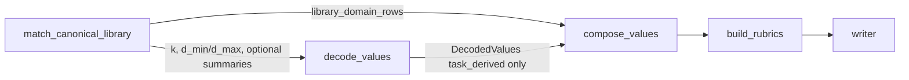

# Design: Canonical value and rubric library (similarity matching)

**Status:** Draft for review  
**App:** `apps/smart-writer`  
**Related:** `Improvement-suggestions.md` (semantic priority **#3**), `docs/TODO-smart-writer.md` (idea 1 + crosswalk), `docs/design-weighted-values-craft-hygiene.md` (craft templates, weights, provenance), `docs/design-retrieval-grounding.md` (orthogonal: evidence vs criteria), `docs/ARCHITECTURE.md`

---

## 1. Purpose

Introduce a **finite, reusable library of domain writing values**—each with a **stable id**, **display metadata**, and a **versioned full rubric** (5×5 grid)—and use **embedding similarity** between the user’s writing brief (`raw_input`) and **library entry descriptors** to **reuse** matching entries instead of re-deriving similar criteria and rubrics on every run.

**Problems addressed**

- **Semantic drift:** The value decoder and rubric builder can emit **near-duplicate** labels (“persuasive impact” vs “donor persuasion”) with **different rubric text** across runs, harming **consistency of judgment** and eval reproducibility.  
- **Cost and latency:** `decode_values` + **N × `build_rubrics`** LLM calls are paid **again** for tasks that map to the same underlying success criteria.  
- **Product differentiation:** A **curated, bounded** library (on the order of **15–20** canonical **domain** entries, separate from **craft** hygiene) makes Smart Writer behave more like a **criteria engine with a known vocabulary** than a one-off critic per session.

**Relationship to other designs**

| Layer | Role |
|-------|------|
| **Craft / hygiene** (`design-weighted-values-craft-hygiene.md`) | Small **fixed** set (`CRAFT_*`), **templates in code**, always-on. |
| **Canonical domain library (this doc)** | **Finite but larger** set of **reusable domain** criteria (e.g. grant persuasion, technical clarity for docs); **stored rubrics**; **matched** by similarity; **versioned** like craft templates but may live in DB. |
| **Task-derived decoder** | Fills remaining slots when the library does not cover the brief, or **refines** labels when hybrid mode is on. |
| **Retrieval grounding** (`design-retrieval-grounding.md`) | **Evidence** for factual discipline; **does not** replace value/rubric criteria. Library matching is about **which rubrics apply**, not **which web pages to cite**. |

---

## 2. Goals and non-goals

### 2.1 Goals

- **G1 — Bounded domain library:** Maintain **on the order of 15–20** canonical **domain** entries (configurable cap), each with `canonical_id`, name, description, optional **tags/genre**, and a **full `ValueRubric`** aligned to existing **`RUBRIC_MAX_TOTAL`** geometry.  
- **G2 — Similarity-based match:** For each run, compute **one embedding** (or a small fixed set—see **§5.2**) from `raw_input` and compare to **precomputed embeddings** of library **match texts** (see **§4.2**); retrieve **top‑k** candidates above a **minimum similarity** threshold.  
- **G3 — Cheaper rubric path for library rows:** When a library entry is **selected**, **clone** its stored rubric and run **one** **refresh-anchors** LLM (**§5.5**) instead of a **full** open `build_rubrics` call—same geometry, less drift than a from-scratch grid.  
- **G4 — Composability with craft + task-derived values:** After **`compose_values`** (weighted design), the full set of assessed values remains **craft ∪ library_matched ∪ decoder_filled**, with **derived `provenance`** on each row (**§4.1**).  
- **G5 — Deterministic tie-breaking:** Ordering when multiple library entries match is **rule-based** (score, margin, stable `canonical_id` order)—no silent randomness.  
- **G6 — Observability:** Log **which** canonical ids were used, **similarity scores**, and **library version** in Logfire and optional Supabase `final_output` / turns.  
- **G7 — Governance hooks:** Support **promoting** a task-derived value+rubric into the library via **semi-automatic** suggestions + **human** approval (**§13.1**) and **version bumps** when rubric text changes.

### 2.2 Non-goals (initial release)

- **NG1 — Automatic growth to unbounded library** without operator review—**no** uncontrolled “add every novel decoder output” in production unless behind a flag and **§13** governance is defined.  
- **NG2 — Replacing** the value decoder entirely—**v1** assumes **hybrid** (library partial match + decoder for the rest) unless explicitly configured as **library-first minimal decode** (**Mode B** — **§5.4**). The v1 **default** (Mode A; B optional later) is stated in **§14.1.2**; **§14** records decisions, not mode mechanics.  
- **NG3 — Multilingual library** in v1—assume **one primary locale** for library text; i18n is a later concern.  
- **NG4 — User-authored canonical rubrics in the hot path**—personal libraries may be a **future** product surface; v1 focuses on **system/operator** curated entries.  
- **NG5 — Merging grounding and library**—retrieval evidence and canonical rubrics remain **independent** composable layers.

---

## 3. Comparison to adjacent designs

| Aspect | Craft templates (priority #2) | Canonical domain library (this doc) | Task-derived decoder |
|--------|--------------------------------|--------------------------------------|----------------------|
| **Count** | 3–5 fixed | ~15–20 bounded | **Total** domain rows per run in **[MIN, MAX]** (e.g. 5–8); split between library + decoder (**§5.3.1**) |
| **Storage** | Code / git (`CRAFT_*`) | DB or git + optional pgvector | Ephemeral per run |
| **Rubric origin** | Versioned template | Stored per canonical entry | LLM `build_rubrics` |
| **Selection** | Always included (minus env subset) | **Similarity match** on `raw_input` | LLM decode from prompt |
| **Provenance** | `designer_craft` | **`library_canonical`** | `task_derived` |

**Retrieval grounding:** Library matching uses **embeddings of text** (brief ↔ library descriptors), not **URL fetch** or **search hits**. A run may use **both** grounding (evidence bundle) and **library rubrics** (criteria stability).

---

## 4. Data model (new / extended)

### 4.1 `ValueDefinition` / provenance (**Option B — locked**)

**Do not store** a separate `provenance` field alongside origin keys. **`provenance`** is a **computed** property on `ValueDefinition` (see `app/agents/models.py`):

| Stored fields | Derived `provenance` |
|---------------|----------------------|
| `craft_key` set | `designer_craft` |
| `canonical_id` set (mutually exclusive with `craft_key`) | `library_canonical` |
| neither set | `task_derived` |

Additional fields (align with implementation):

- `canonical_id: str | None` — **Catalog primary key** (immutable slug in `canonical_values` / seed JSON).  
- `value_id: str` — For **`library_canonical`** rows: **Option A (locked)** — **`value_id = LIB_<canonical_id>`** exactly (prefix constant **`LIB_`**). Implemented by **`library_value_id()`** in `app/agents/canonical_library_ids.py`; **`ValueDefinition`** validates the match when `canonical_id` is set. Decoder output **must not** use the `LIB_` prefix (reserved).  
- `raw_weight` / `weight` — same pipeline as weighted-values design; library rows may use **default raw_weight** from entry metadata.

**`CanonicalValueEntry.rubric`:** set `ValueRubric.value_id` to the same **`library_value_id(canonical_id)`** as the composed row so assessors and `BuiltRubrics` stay aligned.

### 4.2 `CanonicalValueEntry` (library row)

Suggested Pydantic model for storage and API:

| Field | Purpose |
|-------|---------|
| `canonical_id` | Stable string PK (e.g. `grant_nonprofit_persuasion`). |
| `name` | Display title; aligns with **`ValueRubric.value_name`** after compose (see **§8**). |
| `short_description` | Curator copy for **humans**; on match, copied to **`ValueDefinition.description`** (same pipeline field **task_derived** values use). **Not** a second runtime field—see **`value_definition_from_canonical_entry`**. |
| `match_text` | Text used to build the **embedding** (can be **longer** than `short_description`: synonyms, typical prompts, negative examples). |
| `embedding_model_id` | **Which** embedding model produced `embedding` (for invalidation). |
| `embedding` | **Vector** (if stored in DB—pgvector) **or** omitted if using on-the-fly embed + file-backed index. |
| `rubric: ValueRubric` | Full 5×5 rubric; **`value_id`** = **`library_value_id(canonical_id)`**; set **`value_name`** ≈ **`name`** (short label in rubric UI); longer assessor copy comes from **`short_description` → `ValueDefinition.description`**, not from **`value_name`**. |
| `library_version` | Monotonic int or semver string for **change control**. |
| `tags: list[str]` | Optional genre filters (e.g. `nonprofit`, `technical`). |
| `default_raw_weight: float` | **> 0**, default **`1.0`** — copied to **`ValueDefinition.raw_weight`** when the row is matched; same semantics/caps as decoder **`raw_weight`** (**§4.2.2**). |
| `enabled: bool` | Soft-delete / rollout. |
| `created_at`, `updated_at` | Audit. |

**Embeddings:** which string is embedded — **§4.2.1** (resolved).

### 4.2.1 `match_text` vs display fields (**locked for v1**)

**Question (former §14.2 open item on embedding text):** Should the corpus vector come from **`match_text`** only, from **`name` + `short_description`**, or from an **LLM-expanded** synonym blob?

**Recommendation:**

| Approach | Role |
|----------|------|
| **`match_text` (required)** | **Single source** for the **stored embedding**. Curators write it for **retrieval**: short label, **synonyms**, typical user phrasings (“donor letter,” “annual appeal”), optional **negative** cues (“not general marketing”). Same model as **§5.1** query side. |
| **`name`, `short_description`** | **Human/assessor/UI** copy; **not** required to equal `match_text`. They may be **shorter** or more polished than the matching blob. |
| **LLM-expanded synonyms** | **Out of scope for v1** — extra cost, versioning, and QA; consider only if **`match_text`** maintenance does not scale. |

**Implementation:** On ingest / update, compute **one** embedding from **`match_text.strip()`** (reject empty). Do **not** maintain parallel embeddings from **`name`+`short_description`** unless a later phase adds a **second** retrieval channel (e.g. reranker).

**Migration / tooling:** If a row has empty **`match_text`**, backfill **`match_text := name + "\n\n" + short_description`** once, then have humans enrich—do not embed **`name` alone** long-term.

### 4.2.2 Library rows and **`raw_weight`** (**locked**, resolves former §14.2 weights item)

**Recommendation:** **`library_canonical`** rows **do** carry a catalog **`default_raw_weight`** (**§4.2** table). On match, set **`ValueDefinition.raw_weight = entry.default_raw_weight`** before **`compose_values`**. **Rationale:** product can emphasize stable criteria (e.g. **1.5** for “donor alignment”) without a second weight system; **decoder-emitted** **`raw_weight`** on **`task_derived`** rows stays unchanged.

- **Seed default `1.0`** — neutral vs other domain values unless curated.  
- **Same bounds** as **`ValueDefinition`**: strictly positive; cap **10.0** in validation (align with **`app/agents/models.py`**).  
- **Overrides:** **`SMART_WRITER_VALUE_WEIGHTS`** JSON (**`design-weighted-values-craft-hygiene.md` §8.1**) may override **`LIB_*`** **`value_id`s** per deployment without editing the catalog.

**Deferred:** Per-request or per-genre **multipliers** on top of catalog defaults—only if **`tags` + routing** later needs it; v1 is **catalog field + env JSON**.

### 4.3 `LibraryMatch` (per run, diagnostic)

- `canonical_id`  
- `similarity: float` — cosine similarity on **L2-normalized** vectors, range **[-1, 1]** (same as **§5.2.1**)  
- `rank: int`  
- `matched: bool` — **true** if above **`LIBRARY_MATCH_THRESHOLD`**

### 4.4 `AgentState` / orchestration outputs

Add (names illustrative):

- `library_matches: list[LibraryMatch]`  
- `canonical_entries_used: list[CanonicalValueEntry]` (or ids + resolved rubrics in `BuiltRubrics`)  
- `library_resolution_notes: str | None` — optional LLM or rule summary when **hybrid** selection runs.

Existing **`decoded_raw`**, **`rubrics`**, **`composed_values`** (if present) remain; **§6** defines ordering of steps.

---

## 5. Matching layer (embedding + selection policy)

### 5.1 Embedding source for the query side

- **Primary:** Embed **`raw_input`** (or a **normalized** variant: strip HTML, cap length, optional **title line** extraction).  
- **Optional:** Also embed **decoder rationale** or a **short “intent summary”** if we add a **cheap** extract step—**not** required for v1.

**Model:** Use the **same** embedding model as stored library vectors (**OpenAI** `text-embedding-3-*` or lab default from env). **Do not** mix models across query and corpus without re-embedding.

### 5.1.1 Embedding HTTP API (**implementation**)

**Module:** `app/agents/embeddings.py` — single place for **L2-normalized** vectors, **cosine** as dot product, and OpenAI **`embeddings.create`** batching.

| Env | Default | Role |
|-----|---------|------|
| **`SMART_WRITER_EMBEDDING_MODEL`** | `text-embedding-3-small` | Must match catalog **`embedding_model_id`** when vectors are recomputed. |
| **`SMART_WRITER_EMBEDDING_BATCH_SIZE`** | `16` | Max inputs per API call (chunked loop for larger sets). |
| **`SMART_WRITER_EMBEDDING_TIMEOUT_SEC`** | `60` | Client timeout per request (clamped **5–600** s). |
| **`SMART_WRITER_EMBEDDING_ON_FAILURE`** | `skip_library` | **`skip_library`** — log, treat **`k = 0`**, continue run without library rows. **`fail_run`** — re-raise / fail the workflow so operators see embedding outages immediately. |

**Batching:** `embed_texts(texts)` slices **`texts`** into batches of **`get_embedding_batch_size()`** and concatenates results **in order**.

### 5.2 Candidate retrieval

1. Load **enabled** `CanonicalValueEntry` rows (from Supabase or local JSON seed).  
2. If using **pgvector**: `ORDER BY embedding <=> query_embedding LIMIT k`.  
3. If **file/local**: brute-force cosine over **in-memory** vectors (fine at **N≈20**).  
4. Apply **`similarity >= LIBRARY_MATCH_THRESHOLD`** to mark **`matched`**.

### 5.2.1 Similarity metric and threshold — **how we close the open question**

**Problem:** A raw numeric threshold is meaningless without a **fixed similarity definition** and **embedding model**; wrong defaults cause **false merges** (wrong rubric) or **never matching** (no benefit).

**Resolution (locked procedure):**

1. **Lock the score in code** — Use **cosine similarity** between **L2-normalized** query and corpus vectors: **`similarity = q · ê`** (dot product of unit vectors), range **[-1, 1]**. Same definition for **pgvector** distance mapping (`<=>` vs cosine) and **in-memory** brute force. Document in **`app/agents/`** (library match module) as the single source of truth.

2. **Env-configurable default** — **`SMART_WRITER_LIBRARY_MATCH_THRESHOLD`** (float in **[-1, 1]**). Ship a **conservative** starting default (favor **precision** over recall): e.g. **0.82** — **not** a promise of optimality; operators **must** override after calibration. Alternative: default **`0.75`** if early evals show **0.82** is too strict—pick one initial value in implementation and **revisit** after step 4.

3. **Optional ambiguity gate (recommended for v1)** — In addition to **`similarity ≥ τ`**, require a **margin** between the **best** and **second-best** candidate among library entries that cleared **`τ`**: **`sim₁ − sim₂ ≥ LIBRARY_MATCH_MARGIN`** (e.g. **0.03–0.05**) before accepting the **top** hit. Suppresses “tie” cases where two different canonical values score nearly the same. Env: **`SMART_WRITER_LIBRARY_MATCH_MARGIN`** (default **`0`** = disabled, or enable with small margin).

4. **Calibration (required before production tuning)** — Maintain a **small labeled set** of **`raw_input` → {expected `canonical_id`(s) or “none”}**. For each candidate **`τ`** (and optional margin), measure **precision** (of accepted matches, how often `canonical_id` is correct) and **recall** (when a gold canonical exists, how often we select it). **Prefer high precision** for v1 (wrong rubric is worse than falling back to task-derived decode). Plot a simple sweep; set **`τ`** (and **`LIBRARY_MAX_MATCHES`**) to hit a **minimum precision** target (e.g. **≥ 0.9** on the set) before loosening for recall.

5. **Observability** — Log **`similarity`**, **`rank`**, **`canonical_id`**, and **top-2 gap** for every candidate considered; store in **`LibraryMatch`** (**§4.3**) so misfires are debuggable without reproducing embeddings.

**Outcome:** The “open” part is not one eternal magic number—it is **(a)** fixed metric + **(b)** conservative default + **(c)** mandatory **eval-driven** **`τ`** for each deployment/corpus + **(d)** optional margin. Item **§14.1.9**.

### 5.3 How many library values per run?

**Policy (recommended default):**

- **Assessors per iteration (value track):** craft (**C**) + **total domain** (**T**). Craft is **separate** from domain (**`design-weighted-values-craft-hygiene.md` §5.2**).  
- **Take up to `LIBRARY_MAX_MATCHES`** (e.g. **3**) **highest-similarity** library entries that pass threshold, **subject to** **`k ≤ MAX_DOMAIN`** after selection (**§5.3.1**) so the decoder can still satisfy **`MIN_DOMAIN ≤ k + d`**.

Constants should be **env-configurable** (`SMART_WRITER_LIBRARY_MAX_MATCHES`, `SMART_WRITER_LIBRARY_MATCH_THRESHOLD`, …).

### 5.3.1 Domain MIN/MAX — **total** library + task-derived (**locked**)

Let **`MIN_DOMAIN`** / **`MAX_DOMAIN`** be the same product constants as **`DEFAULT_MIN_VALUES`** / **`DEFAULT_MAX_VALUES`** in code (e.g. **5** and **8**). They bound **total domain row count**, not the decoder alone.

- **`k`** = number of **library** domain rows selected this run (`library_canonical`).  
- **`d`** = number of **`task_derived`** rows from the decoder.  
- **Invariant:** **`MIN_DOMAIN ≤ k + d ≤ MAX_DOMAIN`**.

**Decoder bounds (given `k`):** the decoder must emit **`d`** with  

**`max(0, MIN_DOMAIN − k) ≤ d ≤ MAX_DOMAIN − k`**.

**Edge cases:**

- If **`k > MAX_DOMAIN`:** invalid configuration for that run — **trim** library matches (prefer lowest similarity), **raise**, or **fail fast**; do not call the decoder until **`k ≤ MAX_DOMAIN`**.  
- If **`k ≥ MIN_DOMAIN`:** **`d` may be `0`** (library alone can satisfy the minimum).  
- **`library_enabled=false`:** **`k = 0`** → decoder obeys **`MIN_DOMAIN ≤ d ≤ MAX_DOMAIN`** (today’s behavior).

**Implementation:** pass **`k`** (and derived **`d_min`**, **`d_max`**) into **`decode_values`** (prompt + validation). **`DecodedValues`** validation uses **dynamic** length **`d`**, not the global **`MIN_DOMAIN`/`MAX_DOMAIN`** on the raw decoder output when **`k > 0`**. Enforced in code by **`validate_decoded_domain_slot_count`** in `app/agents/models.py` after decode.

### 5.3.2 `match_canonical_library` — failure and empty-state matrix

| Situation | **`k`** | **`d_min` / `d_max`** for decoder | **`library_matches`** / notes |
|-----------|--------|-----------------------------------|------------------------------|
| **`library_enabled=false`** | **0** | **`MIN_DOMAIN`…`MAX_DOMAIN`** | Empty list; no embedding calls. |
| **No enabled catalog rows** | **0** | same | Empty; log **once** at debug. |
| **All similarities **`< τ`** | **0** | same | Candidates may still be listed with **`matched=false`**. |
| **Embedding API failure** + **`skip_library`** | **0** | same | **§5.1.1**; log warning. |
| **Embedding API failure** + **`fail_run`** | — | — | **Fail** the run (no decode) unless caught at a higher layer. |
| **`k` from match **>** `MAX_DOMAIN`** | **Trim** to **`MAX_DOMAIN`** (lowest similarity first) **or** fail fast — pick **trim** in P0; then **`d_max = MAX − k`**. | After trim | Log **trim** + ids removed. |
| **Normal hybrid** | **`k ∈ [0, MAX]`** | **`max(0, MIN−k)`…`MAX−k`** | **`LibraryMatch`** rows for considered candidates; **`matched`** only if **≥ τ** (and margin if enabled). |

### 5.4 Hybrid with the decoder (two modes)

| Mode | Behavior |
|------|----------|
| **A — Library augment (default)** | Run **library match** first → **`k`** library domain rows → run decoder with **`d ∈ [max(0, MIN−k), MAX−k]`** per **§5.3.1** so **`k + d`** satisfies **MIN/MAX**. |
| **B — Library first, minimal decode** | Library fills **all** domain slots that clear threshold + **deterministic** padding from a **default genre-agnostic** fallback list—**risky** if match is wrong; only if evals support it. |

**Recommendation:** **Mode A** for v1: decoder still runs to capture **task-specific** criteria not in the library, but **cannot** duplicate **canonical_id**s already selected (prompt constraint + post-validate).

**Cross-reference:** **§2.2 NG2** points here for the **Mode A / Mode B** split. **§14.1.2** records the product choice (hybrid default); this subsection is the **behavioral** spec for both modes.

### 5.5 Rubric build branching

- **Library-matched value (`library_canonical`):**  
  1. **Clone** **`ValueRubric`** from **`CanonicalValueEntry.rubric`**; set **`value_id` / `value_name`** per **Option A** (**§4.1**).  
  2. **One LLM “refresh anchors” pass** (**locked**, resolves assessor-parity question): a **single** structured call that **keeps the same five dimension names** and **1–5 grid shape** but rewrites **`score_1`…`score_5`** (and optional **dimension `description`**) so anchors fit **`raw_input`** **without** inventing new criteria. **Not** a full open-ended rubric rebuild (that is **`task_derived`** path).  
  - Env flag e.g. **`SMART_WRITER_LIBRARY_REFRESH_ANCHORS`** default **`true`**; when **`false`**, use **cloned** rubric only (cheaper, less prompt-specific).  
- **Task-derived value:** existing full **`run_build_rubrics`** per value.  
- **Craft:** unchanged from weighted-values design.

**Cost:** **`k`** library rows ⇒ **`k`** refresh calls **in addition to** **`d`** full rubric builds—not **`k`** full builds.

**Order in `BuiltRubrics.rubrics`:** Document a **stable sort** (e.g. craft block → library → task-derived) for merge ordering and tests.

### 5.5.1 Refresh-anchors agent contract (**implementation**)

**Module:** `app/agents/refresh_rubric_anchors.py`

| Item | Choice |
|------|--------|
| **`result_type`** | **`ValueRubric`** (same schema as full rubric build — one structured object per call). |
| **Prompt input** | JSON: **`user_prompt`**, **`rubric`** (full catalog clone). |
| **Invariants (post-validate)** | Five **dimension `name`** strings **identical** and **same order** as **`base_rubric`**; **`value_id`** / **`value_name`** corrected to match **`base_rubric`** if the model drifts. |
| **Relation to `rubric_per_value_agent`** | **Separate** **`Agent`** (`refresh_rubric_anchors_agent`) with a **narrow** system prompt (refresh only, no new criteria). Reuses **`agent_llm_kwargs("rubric")`** for model id. |
| **Toggle** | **`SMART_WRITER_LIBRARY_REFRESH_ANCHORS`** — when **`false`**, **`run_build_rubrics`** uses **`model_copy(deep=True)`** on the catalog rubric (no LLM). |

**Orchestration:** **`build_rubrics_node`** resolves **`value_id` → `ValueRubric`** via **`library_rubric_map_from_entries`** on **`AgentState.canonical_library_entries`**, merged with optional **`library_rubric_by_value_id`** (explicit overrides). If **`library_canonical`** rows are present but no rubric is found for a **`value_id`**, the orchestrator raises **`ValueError`** (clearer than **`NotImplementedError`**). **`run_build_rubrics`** then **clones** (+ **refresh** when enabled) per **§5.5**.

---

## 6. Graph changes (LangGraph)

**Current (simplified):**  
`decode_values` → `build_rubrics` → `writer` → …

**Proposed:**

1. **`match_canonical_library`** (new, when **`library_enabled`**):  
   - Input: `raw_input`, optional `tags` / `genre` from request.  
   - Output: `library_matches`, list of **selected** `CanonicalValueEntry` (or ids), **`library_enabled`**.  
2. **`decode_values`:** Receives **`k`** library rows (or their summaries) and **`d_min`/`d_max`** from **§5.3.1**; emits **`DecodedValues`** with **only** `task_derived` rows, **`len(values) = d`** in range, and **`raw_weight`** per weighted design.  
3. **`compose_values`** (existing): merges **craft** + **library** + **task-derived**; normalizes weights.  
4. **`build_rubrics`:**  
   - For each **library_canonical** row: clone stored rubric → **one** **refresh-anchors** LLM pass (**§5.5**).  
   - For each **task_derived** row: **existing** `run_build_rubrics` (possibly batched).  

When **`library_enabled=false`**, **skip** step 1 and pass **empty** library list; graph matches today’s behavior.

**Grounding:** If **`grounding_enabled`**, **`retrieve_evidence`** stays as in **`design-retrieval-grounding.md`** (typically after rubrics / before writer); **library matching** is **upstream** of rubric materialization and **orthogonal** to evidence.

### 6.1 Graph vs `compose_values` — **resolved** (read this to avoid a common misread)

**There is no contradiction** between the pipeline diagram and **`DecodedValues`**:

- **`decode_values`** emits **only** **`task_derived`** rows (**no** **`LIB_*`**, **no** **`canonical_id`**) — see **`DecodedValues`** validator in `app/agents/models.py`.
- **`match_canonical_library`** produces **`library_domain_rows`** (a list of **`ValueDefinition`** from **`value_definition_from_canonical_entry`**) and passes them **straight into** **`compose_values`** — **not** inside **`DecodedValues`**.
- A **linear** sketch **`match → decode → compose`** is easy to misread as “everything domain-shaped comes out of decode.” **False:** library rows **merge at** **`compose_values`** via the **`library_domain_rows`** argument (**§6.2**).

### 6.2 `compose_values` contract (**implementation**)

**Signature:** `compose_values(decoded_raw, *, library_domain_rows=None, craft_enabled=..., ...)` in `app/agents/compose_values.py`.

| Input | Role |
|-------|------|
| **`decoded_raw: DecodedValues`** | **Task-derived only** — no **`LIB_*`**, no **`canonical_id`** (enforced by **`DecodedValues`** validator). |
| **`library_domain_rows: list[ValueDefinition] \| None`** | **`k`** rows with **`canonical_id`** set and **`value_id = library_value_id(canonical_id)`** — built **outside** the decoder via **`value_definition_from_canonical_entry`** (`app/agents/canonical_library.py`). |

**Field mapping (`CanonicalValueEntry` → `ValueDefinition`):**

| Catalog | Composed row |
|---------|----------------|
| **`name`** | **`name`** |
| **`short_description`** | **`description`** (writer/assessor copy) |
| **`default_raw_weight`** | **`raw_weight`** (before **`SMART_WRITER_VALUE_WEIGHTS`** override) |
| **`canonical_id`** | **`canonical_id`** |
| — | **`value_id`** = **`library_value_id(canonical_id)`** |

**Merge order:** **craft** (if any) → **`library_domain_rows`** → **`decoded_raw.values`**. **Domain weight mass** **`(1 − α)`** is shared across **library + task-derived** proportionally to **`raw_weight`** (same as **§7.5** two-stage rule).

**Graph state:** **`compose_values_node`** reads **`library_domain_rows`** (and passes **`library_domain_count`** into **`validate_decoded_domain_slot_count`** from **`decode_values_node`**).

### 6.3 `build_rubrics` — catalog rubrics from state (**implementation**)

**`match_canonical_library`** should set **`canonical_library_entries: list[CanonicalValueEntry]`** (selected rows with full **`rubric`** payloads). **`build_rubrics_node`** builds the rubric map with **`library_rubric_map_from_entries`** in `app/agents/canonical_library.py`, merged with **`library_rubric_by_value_id`** when operators inject overrides. **`run_build_rubrics`** no longer depends on **`NotImplementedError`** for library rows when state is consistent.

---

## 7. Scoring, merge, and stop rules

- **Per-value rubrics** from the library are **indistinguishable** from freshly built rubrics in **shape** (still 0–25 totals).  
- **Weighted merge** and **plateau / targets_met** follow **`design-weighted-values-craft-hygiene.md`**; **`library_canonical`** rows participate like **`task_derived`** in **weight mass** unless a **config** down-weights them (not required v1).  
- **Grounding:** If enabled, **conjunctive** gates per **`design-retrieval-grounding.md` §7**—library does **not** change grounding math.

---

## 8. Writer and assessor prompts

- **Writer / assessors** consume **`ValueDefinition`** + **`ValueRubric`**: they see **`description`** (value meaning), **`value_name`** / dimension text from the rubric, etc. **Library rows:** **`description`** is **`CanonicalValueEntry.short_description`** copied at compose time (**§4.2**, **§6.2**); **curate `short_description` accordingly**. **`ValueRubric.value_name`** should stay aligned with **`name`** (short label); do not rely on **`value_name`** for long explanatory copy—that belongs in **`description`**.  
- **No change** to merge **format** beyond provenance metadata in logs.  
- Optional: one line in writer system prompt: *“Some criteria come from the product’s canonical library for consistency.”* — **low priority**.

---

## 9. HTTP / CLI / configuration

### 9.1 FastAPI models (**implementation**)

**File:** `app/entrypoints/http.py`

| Model | Field | Notes |
|-------|-------|------|
| **`AuditRequest`** | **`library_enabled`** | Default **`false`** until **`match_canonical_library`** is wired; forwarded on **`initial_input`**. |
| | **`library_max_matches`** | Optional **`int`**; overrides env for one request. |
| | **`library_match_threshold`** | Optional **`float`** in **[-1, 1]**; overrides env. |
| **`AuditResponse`** | **`canonical_ids_used: list[str]`** | Filled from graph state when the library node runs; default **[]**. |
| | **`library_version_aggregate: str \| None`** | Optional catalog version string from state. |

Other **`AuditRequest`** / **`AuditResponse`** fields (iterations, plateau, grounding, …) are unchanged.

- **CLI:** `--no-library` / `--library-max-matches` — **not** implemented in **`app/main.py`** yet; HTTP + env only for P0.  
- **Env catalog:** see **§5.1.1**, **`SMART_WRITER_LIBRARY_*`**, **`SMART_WRITER_EMBEDDING_*`**, and **`apps/smart-writer/.env.example`**.

---

## 10. Persistence and observability

### 10.1 New persistence (beyond `runs` / `turns`)

#### 10.1.1 Storage v1 — **recommendation (resolves §14.2 item on pgvector vs JSON)**

Do **not** treat this as a single forever choice—use **phased storage** aligned with **§12**:

| Phase | Storage | When to use |
|-------|---------|-------------|
| **P0** | **Versioned seed in repo** (e.g. `app/data/canonical_values.json` or a small Python module) listing **`match_text`**, **`canonical_id`**, rubric payload, **`embedding_model_id`**. **Vectors:** compute embeddings **at process startup** (or on first library match) via the **same** API as production, then keep **in memory**; **or** cache derived vectors on disk in **`.gitignore`** for dev speed. **Search:** brute-force cosine over **N ≈ 15–20** — trivial CPU. | Feature development, tests, first gated rollout **without** DB migrations. |
| **P1** | **Supabase (or Postgres) + pgvector** — table **`canonical_values`** with **`embedding`**, metadata, **`enabled`**, GIST/IVFFlat index as needed. | Shared/staging/prod: **operators edit rows** without redeploying the app; **multiple app instances** share one catalog; optional **larger** catalogs later. |

**Recommendation:** **Ship P0 first** (JSON + in-memory matching) so library matching is **testable and shippable** behind a flag **before** schema work. **Move to pgvector in P1** when you need **live catalog updates** or **central** administration—not because cosine over 20 vectors requires a database.

**Avoid for v1:** Committing **large** binary embedding blobs into git; **prefer** text + **recompute** embeddings in CI/dev with a key or **fixture vectors** only for unit tests.

#### 10.1.2 Schema sketch (P1)

- **Table** `canonical_values` (or equivalent) with **`embedding vector`** column if using **Supabase pgvector**.  
- **Migration:** Alembic/SQL or Supabase migration—**§12** phases.

### 10.2 Run logs

- Log **`canonical_id`**, **similarity**, **`library_version`** on **`match_canonical_library`**.  
- **`append_turn`** for **`match_canonical_library`** and for **`build_rubrics`** note which values were **template vs LLM**.

---

## 11. Testing strategy

- **Unit:** Cosine similarity selection with **fixed** vectors; threshold edge cases; **compose_values** with craft + library + domain **counts**.  
- **Unit:** Hybrid decode stub—ensure **no duplicate** semantic slots when library already picked `grant_persuasion`.  
- **Integration (mocked):** Mock embedding API to return deterministic vectors; assert **refresh-anchors** path for **`library_canonical`** (one **smaller** LLM call) vs **full** `build_rubrics` for **`task_derived`**.  
- **Eval (later):** Frozen prompts where **expected `canonical_id`** is known; measure **stability** of chosen ids across model updates (embedding model pin matters).

---

## 12. Phased delivery

| Phase | Scope |
|-------|--------|
| **P0** | Models (`CanonicalValueEntry`, `LibraryMatch`, `canonical_id` on `ValueDefinition`); **in-memory** seed of **3–5** entries; **brute-force** cosine; **`match_canonical_library`** behind **`library_enabled`**; **`build_rubrics`:** clone + **refresh anchors** for library rows (**§5.5**); tests. |
| **P1** | Full **~15–20** curated entries; **Supabase** persistence; **pgvector** index; env knobs; Logfire + **`final_output`** fields. |
| **P2** | **Semi-automatic promotion** (**§13.1**): suggestion queue → **human** approve → canonical row; admin **enable/disable**; **A/B** embedding models gated by evals. |
| **P3** | Optional **user/tenant** sub-libraries; multilingual; **automatic** growth with review queue (**§2.2 NG1**). |

---

## 13. Governance and versioning

- **Rubric edits** bump **`library_version`** per entry (or global manifest version).  
- **Breaking changes:** Re-embed all `match_text` when **`embedding_model_id`** changes.  
- **Human review:** New entries and **promotions** from decoder output should pass **checklist** (distinct from existing ids, eval spot-check) before **`enabled=true`**.

### 13.1 Promotion workflow — **semi-automatic** (**locked**, resolves §14.2)

**Promotion** = moving a **task-derived** value + rubric toward a **new `CanonicalValueEntry`**. The product uses **semi-automatic** promotion:

| Layer | Behavior |
|-------|------------|
| **Automatic / system** | Periodically (or on schedule), scan **aggregated telemetry** (e.g. from **`runs` / `turns`** or anonymized exports) for **recurring** task-derived **value fingerprints**—e.g. stable hash of **`name` + normalized rubric dimension labels** (or full rubric JSON hash), plus **frequency** and optional **embedding of `name` + `description` + short rubric summary** **only**—**not** raw user prompts by default. Surface **candidate** rows in a **suggestion queue** with counts and diffs vs existing **`canonical_id`s**. |
| **Human** | An **operator** reviews each suggestion: assign **`canonical_id`**, write/edit **`match_text`** for retrieval (**§4.2.1**), confirm rubric copy, set **`raw_weight`** default if used. **Nothing is `enabled=true` in the live library until a human approves.** |

**Not in scope for “automatic”:** blind insertion into production; **NG1** still applies—no unbounded growth without review.

**Privacy:** Do **not** cluster or rank promotion candidates using **full `raw_input`** in centralized analytics unless **policy allows** and **redaction** is applied. Prefer **structured outputs** already in **`turns`** (decoded values, rubrics) over prompt text for frequency signals.

**Implementation timing:** **P2** (**§12**)—after core library read path is stable.

---

## 14. Decisions (resolved vs open)

### 14.1 Resolved (working assumptions for implementation)

1. **Orthogonality:** Canonical library is **criteria reuse**; **retrieval grounding** is **evidence reuse**—both may be enabled independently.  
2. **Hybrid v1:** **Mode A** (library augment + decoder) as default; **Mode B** optional later.  
3. **Craft vs domain library:** **Different namespaces** (`CRAFT_*` vs `LIB_*` / `canonical_id`); craft remains **code templates**; domain library is **stored** and **matched**.  
4. **Rubric geometry:** **Unchanged** 5×5 / 25 max per value (**NG4** in weighted design).  
5. **Single embedding model** for query and corpus within a deployment.  
6. **Provenance (Option B):** **`provenance`** is **derived** from `craft_key` / `canonical_id` / neither—**no** second parallel taxonomy; **`ValueProvenance`** includes `library_canonical` as the computed case for library rows. See **§4.1** and `app/agents/models.py`.  
7. **Field naming (Option A):** **`canonical_id`** = catalog PK; **`value_id`** = **`LIB_<canonical_id>`** via **`library_value_id()`**; decoder must not emit **`LIB_`**. See **§4.1**, **`app/agents/canonical_library_ids.py`**.  
8. **Decoder / domain counts:** **`MIN_DOMAIN`/`MAX_DOMAIN`** apply to **total** domain **`k + d`** (library + task-derived); decoder length **`d`** is derived per **§5.3.1**.  
9. **Match threshold:** Cosine on **L2-normalized** vectors **[-1, 1]**; conservative **env default** + **eval calibration** + optional **margin** gate — **§5.2.1**.  
10. **Embedding source text:** **One** corpus embedding per entry from **`match_text`** only (**§4.2.1**); **`name`/`short_description`** for display; **no** LLM expansion in v1.  
11. **Storage v1:** **P0** = repo JSON + in-memory cosine (**§10.1.1**); **P1** = **pgvector** when ops need DB-backed catalog — not “either/or” for all time.  
12. **Promotion:** **Semi-automatic** — system **suggests** candidates from recurring task-derived **value+rubric signals**; **human** approves before **`enabled`** (**§13.1**).  
13. **Assessor parity:** **One** LLM **refresh anchors** pass per **`library_canonical`** row after cloning the stored rubric (**§5.5**); optional env to disable.  
14. **Library weights:** **`default_raw_weight`** on **`CanonicalValueEntry`** → **`ValueDefinition.raw_weight`**; default **1.0**; **`SMART_WRITER_VALUE_WEIGHTS`** may override **`LIB_*`** ids (**§4.2.2**).

### 14.2 Open — requires discussion before / during implementation

1. ~~**Exact provenance model**~~ — **Resolved:** Option B (**§4.1**, **§14.1.6**).  
2. ~~**Field naming (`value_id` vs `canonical_id`)**~~ — **Resolved:** Option A (**§4.1**, **§14.1.7**).  
3. ~~**Decoder contract (MIN/MAX scope)**~~ — **Resolved:** **§5.3.1**, **§14.1.8** — MIN/MAX bound **`k + d`**, not **`d`** alone.  
4. ~~**Threshold defaults**~~ — **Resolved:** procedure **§5.2.1**, **§14.1.9** (numeric default still tuned per deployment via evals).  
5. ~~**Embedding text**~~ — **Resolved:** **§4.2.1**, **§14.1.10** — embed **`match_text`** only for v1.  
6. ~~**Storage v1**~~ — **Resolved:** phased **§10.1.1**, **§14.1.11** — **P0** JSON + in-memory; **P1** pgvector for shared ops.  
7. ~~**Promotion**~~ — **Resolved:** **semi-automatic** suggestions + **human** approval (**§13.1**, **§14.1.12**).  
8. ~~**Assessor parity**~~ — **Resolved:** **one** **refresh-anchors** LLM per library row (**§5.5**, **§14.1.13**).  
9. ~~**Interaction with weights**~~ — **Resolved:** **`default_raw_weight`** on catalog row (**§4.2.2**, **§14.1.14**).

*No further open items in this subsection; future edits may add new rows here.*

---

## 15. Summary

The **canonical value and rubric library** adds a **bounded, curated set of domain values** with **stored rubrics**, selected per run by **embedding similarity** to `raw_input`, and integrated **before** decode/rubric-build so matched entries use **clone + refresh-anchors** instead of full rubric generation (**§5.5**). **Domain MIN/MAX** apply to **total** library + task-derived counts (**§5.3.1**). It composes with **craft templates** and **task-derived** decoder output (library rows: **`canonical_id` set**, **`value_id = LIB_<canonical_id>`** — **§4.1**), and with **retrieval grounding** as a separate axis. **v1** should ship **hybrid augment mode**, **deterministic** selection rules, **observable** ids and scores, and **phased** persistence from **in-memory seed** to **Supabase + pgvector**. **§14.2** is fully resolved as of **§14.1.14** (weights **§4.2.2**).

---

## 16. Decision log and review notes

### 16.1 Folded decisions (where to implement)

| Topic | Decision | Doc anchor |
|-------|----------|------------|
| **vs craft** | Domain **canonical library** ≠ **craft**; separate selection and storage. | §3, §4.1 |
| **vs grounding** | No merging of **evidence** and **library** into one subsystem. | §1, §2.2 NG5 |
| **Decoder** | **Hybrid augment** default; **`d`** in **`[max(0,MIN−k), MAX−k]`**; **MIN/MAX** on **`k+d`** (**§5.3.1**). | §5.3.1, §5.4 |
| **Rubric LLM** | **`library_canonical`:** clone catalog rubric → **one** **refresh-anchors** LLM (**§5.5**); not a full open build. | §5.5, §14.1.13 |
| **Graph** | New **`match_canonical_library`** before **`decode_values`**. | §6 |
| **Provenance** | **Option B:** derive from `craft_key` / `canonical_id` / neither; **`library_canonical`** is computed when `canonical_id` is set. | §4.1, §14.1.6 |
| **value_id vs canonical_id** | **Option A:** **`value_id = LIB_<canonical_id>`**; helpers in **`canonical_library_ids.py`**; validated on **`ValueDefinition`**. | §4.1, §14.1.7 |
| **Domain MIN/MAX** | Apply to **`k + d`** (library + task-derived); decoder **`d`** bounds **§5.3.1**. | §5.3.1, §14.1.8 |
| **Match threshold** | Cosine **[-1,1]**; env **`τ`** + optional **margin**; calibrate on labeled prompts (**§5.2.1**). | §5.2.1, §14.1.9 |
| **Embedding text** | **One** vector per row from **`match_text`**; display fields separate (**§4.2.1**). | §4.2.1, §14.1.10 |
| **Storage** | **P0** JSON + in-memory; **P1** pgvector (**§10.1.1**). | §10.1.1, §14.1.11 |
| **Promotion** | **Semi-automatic** queue + **human** gate (**§13.1**). | §13.1, §14.1.12 |
| **Refresh anchors** | **One** LLM pass per library row; same 5 dimensions; env to skip (**§5.5**). | §5.5, §14.1.13 |
| **Library `raw_weight`** | **`default_raw_weight`** on entry → composed row; default **1.0**; env JSON overrides (**§4.2.2**). | §4.2.2, §14.1.14 |

### 16.2 Clarifying notes

- **Semantic stability** improves **evals** and **user trust** when the same brief maps to the **same rubrics**; it does **not** by itself fix **factual** gaps—pair with **retrieval grounding** for substance.  
- **Cost savings** vs full **`build_rubrics`:** **`k`** library rows use **`k`** **refresh-anchors** calls (smaller structured edit) instead of **`k`** full rubric builds—embedding over **N≈20** remains cheap (**§5.5**).  
- **False positives** (wrong canonical match) are a **product risk**—mitigate with **threshold**, **max matches**, and **decoder still** emitting **task-specific** values that **contradict** bad matches only if we add **explicit conflict resolution** (future).

### 16.3 Obsolete / superseded

- Early **TODO** idea of “grow list to 15–20 **automatically** from every new decoder output” is **superseded** by **§2.2 NG1** and **§13**—growth is **governed**, not unbounded.

---

## 17. Design review — gaps, inconsistencies, and improvements

*Reviewer pass: implementation-facing. Items are **prioritized within each list** (highest first).*

### (a) Five things missing (priority order) — **addressed in code + doc**

1. **`compose_values` + library wiring** — **Done:** **§6.2**, `compose_values(..., library_domain_rows=...)`, **`value_definition_from_canonical_entry`** (`app/agents/canonical_library.py`), orchestrator **`compose_values_node`** reads **`library_domain_rows`**.

2. **Refresh-anchors agent contract** — **Done:** **§5.5.1**, `app/agents/refresh_rubric_anchors.py`; **`run_build_rubrics(..., library_rubric_by_value_id=...)`** in `app/agents/rubric_builder.py`.

3. **Embedding service I/O** — **Done:** **§5.1.1**, `app/agents/embeddings.py`.

4. **`match_canonical_library` failure and empty states** — **Done:** **§5.3.2** (matrix); **`match_canonical_library`** node still to be wired, but **behavior** is specified.

5. **HTTP/API surface vs code** — **Done:** **§9.1**, `AuditRequest` / `AuditResponse` fields in `app/entrypoints/http.py`.

### (b) Five inconsistencies that will confuse implementers

1. **Graph vs `compose_values`** — **Resolved:** **§6.1** (diagram + prose), **§6.2**, and code **`compose_values(..., library_domain_rows=...)`** / **`compose_values_node`**. Library rows **never** appear in **`DecodedValues`**; they are **injected at** **`compose_values`**.

2. **`rubric_builder` vs design** — **Resolved:** **`run_build_rubrics`** implements **clone + refresh** when a catalog rubric map is supplied; **`build_rubrics_node`** derives that map from **`canonical_library_entries`** (**§6.3**) or **`library_rubric_by_value_id`**. Remaining gap is only the **`match_canonical_library`** graph node populating **`canonical_library_entries`** (and **`library_domain_rows`**) together.

3. **`ValueDefinition.description` vs catalog `short_description`** — **Resolved:** **§4.2** table and **§8**; runtime mapping is **`description := short_description`** via **`value_definition_from_canonical_entry`** (`app/agents/canonical_library.py`).

4. **NG2 cross-reference** — **Resolved:** **§2.2 NG2** cites **§5.4** (Mode B) and **§14.1.2** (default decision); **§5.4** notes the **§14.1.2** / **NG2** relationship. Mode B is specified in the **§5.4** table.

5. **`value_name` vs `name` / `short_description`** — **Resolved** with **§4.2** / **§8**: **`value_name`** ≈ short label (**`name`**); explanatory copy for assessors/writer comes from **`description`** (**`short_description`** in catalog).

### (c) Five improvements to the design

1. **Add §6.1 “Data flow diagram”** — One diagram: **`raw_input`** → **`match_canonical_library`** → **`k`** **`CanonicalValueEntry`** → build **`library_value_definitions[]`** → **`decode_values(d_min,d_max)`** → **`merge_domain_rows`** → **`compose_values`** → **`build_rubrics`**. Reduces onboarding time.

2. **Define `refresh_rubric_anchors` as a named function** — Interface: **`(user_prompt: str, rubric: ValueRubric) -> ValueRubric`** with **invariants** asserted in tests. Makes **§5.5** testable without reading the whole graph.

3. **Pin `SMART_WRITER_*` env catalog** — Single table: **embedding model**, **threshold**, **margin**, **max matches**, **refresh anchors on/off**, **library enabled**, **path to seed JSON** — so **§9** and **§10** are not duplicated.

4. **Explicit “library off” compatibility** — Statement: **`library_enabled=false`** ⇒ **zero** new code paths in **`decode_values`** / **`compose_values`** beyond feature flags (or **branch** only in **`match_canonical_library`**). Helps **regression** tests.

5. **Bump document `Status`** — When **§14.2** is empty, set **Status** to **“Ready for implementation (P0)”** or add a **“Readiness”** line: **P0** scope = §§4–6, 10.1.1 P0, 11, 12 P0 — so scope creep is visible.

---

*End of document.*
