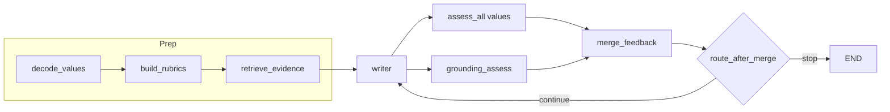

# Design: Retrieval grounding for Smart Writer

**Status:** Draft for review  
**App:** `apps/smart-writer`  
**Related:** `Improvement-suggestions.md` (semantic priority #1), `docs/TODO-smart-writer.md`, `apps/research-auditor` (claim/evidence + critic pattern)

---

## 1. Purpose

Add **retrieval grounding** so drafts are **substantively anchored** in the real world (correct organizations, plausible facts, timely context) rather than generic or hallucinated filler—**without** turning Smart Writer into a **proof** or **citation engine**.

Typical uses:

- **Grant / nonprofit copy** — the real donor, the real recipient, concrete mission and program detail; not abstract “organizations in general.”  
- **Explainer / article** (e.g. policy, markets) — directionally correct, current-aware narrative; not invented statistics or fake institutions.

Users are expected to **embed hints in the free-form prompt** (donor name, recipient, program details, topic constraints, links)—the same pattern as mainstream genAI products. **Structured “fact sheet” fields in the UI are optional** later; they are not required to get strong grounding if the prompt is clear or contains links.

Grounding feeds:

1. **Writer** — conditions on a bounded **evidence bundle** (fetched page text from URLs in the prompt, optional fact-sheet text or linked documents, plus optional web-search supplements). The **published draft reads naturally**: no mandatory inline citations, footnotes, or `[chunk_id]` markers unless the user explicitly asks for that style.  
2. **Reviewers** — value assessors stay rubric-focused. A **grounding assessor** scores whether the draft is **consistent with the bundle** and **appropriately concrete** (flags likely invention, vagueness when specifics exist, or drift away from retrieved entities/topics)—**editorial QA**, not academic audit.

**Relationship to Research Auditor:** Same *shape* (evidence in → model out → critic loop) but a **softer bar**: we optimize for **useful, trustworthy prose**, not **per-claim verified proof** or display citations.

---

## 2. Goals and non-goals

### 2.1 Goals

- **G1 — Evidence bundle per run:** A first-class artifact listing sources and normalized **snippets** (with URL, title, fetched_at, optional chunk hash) stored in workflow state and optionally in Supabase turns (for **debugging / replay**, not for forcing citations in the user-visible draft).  
- **G2 — Writer uses evidence:** The writer sees the bundle (or a token-budgeted subset) and instructions to **prefer retrieved facts and named entities**, avoid inventing organizations or numbers, and use **natural prose**—no required citation apparatus in the output unless product mode says otherwise.  
- **G3 — Grounding assessor:** Structured output scoring **alignment with evidence**, **risk of invention**, and **over-generic language** where specifics were available; **mergeable feedback** for the writer loop (same pathway as value-assessor feedback).  
- **G4 — Deterministic stopping:** **Value** and **grounding** metrics stay **separate**; each has testable thresholds and history for plateau (see **§7**—no single blended aggregate for pass/fail).  
- **G5 — Configurable retrieval:** Pluggable pipeline (URL extraction + fetch, optional fact-sheet URL/text, optional web search API) with env-based limits (top-k, max chars, max fetches, allowed domains).  
- **G6 — Prompt-first UX:** Treat **`raw_input` as the primary carrier** of facts and source links; process embedded URLs and pasted blocks without requiring separate form fields (optional API fields may mirror paste for convenience).

### 2.2 Non-goals (initial release)

- **NG1 — Full legal/compliance “fact checker”** or **proof-grade** verification for all domains; scope is **retrieval + soft verification** + LLM grading, not guarantees from an external KB.  
- **NG1b — Mandatory citations in final copy** for default “professional / creative” mode (optional **scholarly** mode may add citations later).  
- **NG2 — Real-time browsing inside every assessor call** unless explicitly designed; retrieval runs in controlled **retrieve** nodes, not ad hoc per token.  
- **NG3 — Replacing** value-based rubrics; grounding is **orthogonal** and **composable**.  
- **NG4 — Vector DB for retrieval** in v1 unless already available; v1 may use **search API + snippet store** only.

---

## 3. Comparison to Research Auditor

| Aspect | Research Auditor | Smart Writer (this design) |
|--------|-------------------|----------------------------|
| Primary output | `ResearchOutput` (claims + quotes from **given** source text) | **Draft** text for user prompt + evidence from **retrieval** |
| Critic focus | Validate claims vs **quoted** source | **Substantive** fit vs **evidence bundle** (invention risk, specificity); not proof-per-sentence |
| Loop | Researcher ↔ Critic | Writer ↔ (value assessors + merge) ↔ **grounding assessor** (ordering in §6) |
| Evidence origin | User supplies full document | **Retrieve** + optional user attachments |

**Reuse:** Optionally reuse **issue category names** where they still fit (`UNSUPPORTED_OR_UNVERIFIED_FACT`, `WEAK_SUPPORT`, `TOO_GENERIC`, `ENTITY_MISMATCH`); prefer **editorial** categories over auditor-style `MISQUOTE` unless the user enables a strict mode. JSON shapes stay Smart-Writer-specific.

---

## 4. Data model (new / extended)

### 4.1 `SourceRef` and `EvidenceChunk`

- **`SourceRef`:** `source_id` (stable in-run), `kind` (`url` | `upload` | `search_hit`), `title`, `url` (optional), `retrieved_at` (ISO8601), `snippet` (short preview for UI).  
- **`EvidenceChunk`:** `chunk_id`, `source_id`, `text` (verbatim excerpt), `char_start` / `char_end` optional, `query` (optional; which search query produced it), **`provenance`** — `Literal["user_supplied", "url_fetch", "search_hit"]` (set when the chunk is built: pasted/user text vs fetched HTML vs search tool/API). Used for writer trust hints and observability.

Caps: `MAX_CHUNKS`, `MAX_TOTAL_CHARS` (config) to bound prompts.

### 4.2 `EvidenceBundle`

- `chunks: list[EvidenceChunk]`  
- `sources: list[SourceRef]` (deduplicated)  
- `retrieval_notes: str` (optional; model or tool summary of coverage gaps)

Persisted in `AgentState` and serialized in `turns` JSON for debugging.

### 4.3 `GroundingAssessment` (Pydantic, grounding assessor output)

Suggested fields (names can be adjusted in implementation):

- `grounding_score: float` — `0.0`–`1.0` (single scalar for aggregation).  
- `supported_ratio: float` — fraction of checked assertions deemed supported (if using assertion list).  
- `issues: list[GroundingIssue]` — each with `severity` (`MUST_FIX` | `SHOULD_FIX` | `NIT`), `category` (e.g. `LIKELY_INVENTED_DETAIL`, `UNSUPPORTED_OR_UNVERIFIED_FACT`, `TOO_GENERIC`, `ENTITY_OR_TOPIC_DRIFT`, `WEAK_SUPPORT`, `POSSIBLY_STALE`, optional strict-only `MISQUOTE`), `excerpt_from_draft` (optional), `fix_guidance: str`.  
- `summary: str` — short narrative for merge.  
- `writer_instructions: str` — **paragraph** to pass into merge (same role as value assessor “change” bullets).

Optional advanced field:

- `assertion_checks: list[AssertionCheck]` — `assertion`, `supported: bool`, `supporting_chunk_ids: list[str]`.

### 4.4 `AgentState` extensions (`app/orchestrator/run.py`)

- `evidence_bundle: EvidenceBundle | None`  
- `last_grounding_assessment: GroundingAssessment | None`  
- `grounding_enabled: bool` (from request / config)  
- Optional: `retrieval_query: str` — normalized query derived from `raw_input` for tools.

Existing fields (`draft`, `merged_feedback`, `last_assessments`, …) stay; add **`grounding_score` history** alongside **value aggregate history** for dual-track stop rules (§7).

---

## 5. Retrieval layer

### 5.0 User prompt, fact sheets, and precedence

**UX assumption:** The main interaction is a **single free-form prompt** (`raw_input`), like typical genAI apps. Users naturally drop in **names, numbers, constraints**, and **URLs** (“see https://…”, “our annual report: …”). Dedicated UI sections for “fact sheet” or “source links” are **optional** enhancements; the backend should behave well when everything lives in `raw_input` alone.

**What we process:**

| Input | Behavior |
|-------|----------|
| **Pasted fact sheet** in the prompt (or optional `reference_material` / file upload later) | Chunk as **user-origin evidence** (high trust for named entities the user asserted). |
| **URL to a fact sheet or doc** (user says “details at …” or only pastes a link) | **Fetch** that URL (HTML/PDF per capability), extract text, add to bundle as **fetched source**. |
| **Other HTTP(S) URLs** in the prompt | **Extract** links (regex; optional light model pass for messy prose), **fetch** each up to a cap (see **§5.4**), chunk → `EvidenceChunk`s with `provenance=url_fetch`. |
| **No URLs and minimal proper nouns** | Optionally run **`WebSearchBackend`** (see **§5.1**) using a **query derived from** `raw_input` to gather context (supplement, not replace user text). |

**Recommended merge order when building the bundle:**

1. **User-explicit text** in the prompt (and optional `reference_material`) — always included as chunks with **`provenance=user_supplied`**.  
2. **Fetched content** from URLs discovered in the prompt (and from explicit fact-sheet links) — **`provenance=url_fetch`**.  
3. **Search hits** — fill gaps or add recency; trim to budget — **`provenance=search_hit`**.

If the user provides **both** a rich prompt and links, **fetch wins for factual detail** on those pages; the prompt still sets **intent and tone** for the writer and value decoder.

**Implementation note:** A **composite** `retrieve_evidence` step may orchestrate: `extract_urls(raw_input)` → `fetch_url` (async, bounded) → optional `search(query)` → `merge_evidence_bundle(...)`.

### 5.1 Interface

Define a protocol or small set of composable pieces, e.g.:

- `extract_urls(text: str) -> list[ParsedUrl]`  
- `async def fetch_url(url: str, *, budget: FetchBudget) -> EvidenceChunk | None`  
- `async def search_web(query: str, *, budget: RetrievalBudget) -> EvidenceBundle`  
- `async def build_bundle_from_prompt(raw_input: str, *, optional_reference: str | None, budget: CombinedBudget) -> EvidenceBundle`

Legacy single-interface option:

- `async def retrieve(query: str, *, budget: RetrievalBudget) -> EvidenceBundle` — can remain the façade for **search-only** backends; **URL-first grounding** should call **`build_bundle_from_prompt`** (or equivalent) in the graph node.

**Implementations (v1 → later):**

1. **`UrlFetchEvidenceSource`** — HTTP(S) fetch + readable text extraction (respect size limits, content-type); **§5.4** applies.  
2. **`UserTextEvidenceSource`** — `reference_material` or delimited paste blocks in `raw_input` (optional convention, e.g. “---FACTS---”).  
3. **`WebSearchBackend`** — pluggable **search** only: OpenAI/LLM **vendor web tools** (preferred default when configured—see **§5.4**), or Tavily, Brave, SearXNG, etc., for **supplemental** context when URLs are sparse or absent. **Not** the same as **`build_bundle_from_prompt`**, which **orchestrates** extract → fetch → optional search.  
4. **`NoopProvider`** — empty bundle; writer uses only prompt text and must hedge.

**Naming:** Use **`WebSearchBackend`** for “search-only” integrations; avoid overloading **`SearchApiProvider`** for the composite orchestrator.

### 5.2 Query formation

- **URLs:** Prefer **deterministic extraction** from `raw_input` first; optionally use a small model to list “canonical URLs” if the user buries links in sentences.  
- **Search query:** Derive from `raw_input` when search is needed (strip boilerplate, add domain keywords, optional LLM summarization to one query).  
- **Optional:** User supplies `research_query` in API/CLI (future override).

### 5.3 Safety (logging and limits)

- **Max URL fetches**, **timeout**, **robots** respect for scraper (if any).  
- **No secrets** in logs; redact API keys.  
- Optional **domain blocklist** env (see **§5.4**); **no mandatory global allowlist**—product scope is open-ended.

### 5.4 Fetch security (SSRF) — open web, blocklist + hardening

Smart Writer targets **arbitrary user-chosen URLs**; a **strict URL allowlist** is **not** acceptable for the product. Mitigations:

1. **Prefer LLM-vendor retrieval first (default preference):** When **`SMART_WRITER_SEARCH_PROVIDER=openai_web`** (or equivalent), use the **vendor’s web search / browsing tools** so **fetch semantics** run partly **inside the vendor’s controlled path** (same billing as completions). **Still normalize** tool output into **`EvidenceBundle`**; **do not assume** the vendor eliminates all abuse—validate size and strip scripts.

2. **Direct `httpx` fetch** (user-pasted URLs): **Mandatory baseline controls** (implement in code):
   - **Scheme:** `https` only by default; `http` configurable off.  
   - **SSRF:** After DNS resolution, **reject** destinations in **private/special-use** ranges (RFC1918, loopback, link-local, metadata IPs); cap **redirects** and re-check resolved IPs; cap **response bytes** and **wall-clock time**.  
   - **Blocklist:** Env **`SMART_WRITER_FETCH_DOMAIN_BLOCKLIST`** (suffixes or hosts, e.g. internal corp TLDs)—**curated by operator**, not auto-generated. Optional public **disposable / abuse** lists if maintained.  
   - **No silver bullet:** LLM tools reduce **our** origin’s exposure to raw SSRF on arbitrary URLs but **do not** replace defense-in-depth on any path that still does **server-side fetch**.

3. **Rejected as mandatory policy:** “Never use user URL; always re-resolve via search only”—**not required** (loses exact PDFs/deep links; extra cost). **Optional** “search canonicalize” may exist for **suspicious** URLs only.

4. **Third-party “reader” APIs** (Jina Reader, Firecrawl, …): optional; treat as **another backend** with their own ToS.

---

## 6. Graph changes (LangGraph)

### 6.1 Placement of nodes

**Current (simplified):**  
`decode_values` → `build_rubrics` → `writer` → `assess_all` → `merge_feedback` → (conditional) → …

**Proposed (with resolved routing rules):**

1. After `build_rubrics`, add **`retrieve_evidence`** **only when `grounding_enabled` is true**. When **`grounding_enabled=false`**, **skip** this node (and **`grounding_assess`** below)—no no-op stubs; graph branches to writer without retrieval overhead.  
   - Input: `raw_input`, optional `decoded` for domain hints.  
   - Output: `evidence_bundle`, `retrieval_query`.  
2. **`writer`** node: pass `evidence_bundle` (or `None` / empty when grounding off).  
3. **`assess_all`:** unchanged parallel **value** assessors (rubrics).  
4. **`grounding_assess`** **only when `grounding_enabled` is true**. If **`grounding_enabled`** but **`evidence_bundle` is empty** (all fetches failed or no URLs), **still run** grounding assessor with an explicit system hint: *no retrieved evidence—judge hedging vs. confident invention using `raw_input` only.*  
5. **`merge_feedback`:** merge value + grounding into **`merged_feedback`** (ordering **resolved**):  
   - (1) Grounding **`MUST_FIX`** + **`writer_instructions`**; (2) value merged feedback (existing ordering); (3) grounding **`SHOULD_FIX`**. If **length cap**, truncate **value** section first, preserve grounding **head**.  
   **Stopping** (§7) is independent: **continue** while **any** conjunctive gate fails—merge order only affects **writer prompt**, not exit logic.

### 6.2 Ordering and latency

| Option | Pros | Cons |
|--------|------|------|
| **A — Sequential:** value assessors → grounding → merge | Simple, grounding sees same draft as values | Longer wall-clock |
| **B — Parallel:** value assessors ∥ grounding → merge | Faster | Two LLM batches; merge must reconcile |
| **Recommendation:** **B** for latency, with **shared** `draft` snapshot; merge step is deterministic text merge. |

### 6.3 Per-iteration retrieval

- **Default:** Retrieve **once** before first writer (cost + stability).  
- **Optional (later):** `refresh_evidence` every N iterations if `raw_input` includes “latest data” or user flag `allow_refresh_retrieval`.

### 6.4 Diagram

When `grounding_enabled=false`, omit nodes `E` and `G` (and edges into them); diagram below is the **full** grounding path.

### 6.5 Failure-mode matrix (resolved)

| Situation | Writer instruction | Grounding assessor runs? | User-visible note (optional) |
|-----------|--------------------|---------------------------|--------------------------------|
| **`grounding_enabled=false`** | Values + prompt only; no evidence section | **No** | — |
| **Empty bundle, grounding on** (no URLs / fetches failed) | Hedge; avoid invented specifics | **Yes** (no-evidence mode) | Optional: “No pages could be retrieved; draft may be prompt-only.” |
| **Partial fetches** | Use retrieved chunks + note gaps in `retrieval_notes` | **Yes** | Optional: “Some links could not be loaded.” |
| **Grounding on, normal bundle** | Full evidence section | **Yes** | — |

---

## 7. Scoring and stop rules

### 7.1 Do **not** mix value and grounding into one weighted score (resolved)

**Rationale:** A weighted sum (or any linear blend) implies an **acceptable tradeoff**—e.g. strong rubric scores compensating for weak grounding. Here **grounding** and **values/rubric quality** are **orthogonal**: you want **both** acceptable, not one buying off the other.

**Therefore:** Keep **two primary metrics** on separate scales and use **independent thresholds** (conjunctive **AND** gates), not a merged headline score for pass/fail.

| Metric | Typical scale (configurable) | Example gate |
|--------|------------------------------|--------------|
| **Value side** | Sum or mean of per-value totals (each value 0–25 today) | e.g. sum ≥ 100 across five values, or **average ≥ 20/25** |
| **Grounding side** | `grounding_score` **0.0–1.0** in schema (UI may show **×5** as “out of 5”) | Product default intent: **high bar**, e.g. **≥ 0.9** (equivalent **4.5/5** display) |

**Early success (`targets_met`):** If **all** conjunctive gates pass (value **and** grounding **and** any per-value floors), stop with **`stop_reason: targets_met`**. This is **not** the same as **plateau** (diminishing improvement)—see **§7.5**.

### 7.2 Stricter gates: global aggregate + per-part minima

A useful pattern (numeric defaults in **§7.5**):

- **Global:** e.g. sum or mean of per-value totals **≥** threshold.  
- **Plus per-value floors:** e.g. a **low** floor so no value is terrible, plus a **higher** bar for **targets_met**—tune so the loop can finish within **`max_iterations`**.

**Caution if “each individual score” means every rubric dimension:** With **5 dimensions × N values**, full-grid minima make convergence **rare** within typical `max_iterations`. Prefer:

1. **Per-value total** minimums first (N checks).  
2. **Selected critical dimensions** only (metadata on rubric later).  
3. Full per-dimension grid—only with eval evidence.

### 7.3 Plateau and max iterations (two tracks)

Track **separate histories**: `aggregate_value_history` (sum or mean of per-value totals—same convention as today’s “aggregate” for **values only**) and **`grounding_score_history`**.

- **`max_iterations`:** hard cap; always applies.  
- **`plateau_epsilon` (value):** Rename/clarify in code as **`PLATEAU_EPSILON_VALUE`** — minimum **delta** in the **value** aggregate (on the **0–25×N** or chosen summary scale) over `plateau_window` rounds to count as improvement. Align with **“improvement &lt; MIN_IMPROVEMENT”** (e.g. **2** points on the same scale) in **§7.5**—same idea: stop chasing value gains when marginal.  
- **`PLATEAU_EPSILON_GROUNDING`:** Separate from value—applied to **`grounding_score` (0–1)**. If delta &lt; epsilon for `plateau_window` rounds, **grounding** is flat; **do not** reuse the numeric value of `plateau_epsilon` from the value side.  
- **Default stop for plateau:** **`stop_reason: plateau`** when **both** value and grounding improvement have stalled per their respective epsilons over the window (configurable stricter/looser).  
- **`stop_reason` vocabulary:** see **§7.6**.

### 7.4 Reporting

**Internal / persistence:** Always record **`aggregate_value_score`** (value rubrics only) and **`grounding_score`** for debugging, Supabase `final_output`, and Logfire.

**External HTTP (v1 product):** Expose **`aggregate_value_score`** (rename from legacy **`aggregate_score`** everywhere in API/CLI). **Omit `grounding_score` from the default `AuditResponse`** until a later API version—grounding still drives **stopping** internally. Avoid a **single blended** headline number.

### 7.5 Default thresholds (starting point — tune with evals)

Subject to change; implement as env/config.

| Parameter | Suggested start | Notes |
|-----------|-----------------|--------|
| **Grounding gate** | `grounding_score ≥ 0.9` (~**4.5/5** display) | Strong preference for substantive grounding. |
| **Per-value floor** | Low bar, e.g. **≥ 12.5/25** per value (~**2.5/5** average per dimension if spread evenly) | Adjust after seeing convergence rates. |
| **Value “good enough” (type A — threshold)** | Each per-value total **≥ 18/25** (or sum/mean rule—pick one consistent summary) | “Type 1” **targets_met** component for **values**. |
| **Value improvement floor (type B — plateau)** | If per-round **improvement** in value aggregate **&lt; 2** (on 0–25 point total scale), treat as **no meaningful gain** for plateau purposes | Same spirit as **`PLATEAU_EPSILON_VALUE`**; **not** a second `targets_met`—use **`stop_reason: plateau`** when improvement stalls. |
| **`targets_met`** | Requires **both** grounding gate **and** value gates (and floors) **together** | Do not stop on value alone if grounding fails, and vice versa. |

Always enforce **`max_iterations`** regardless.

### 7.6 `stop_reason` values (resolved)

Record explicitly in state and API where exposed:

| `stop_reason` | Meaning |
|---------------|---------|
| **`max_iterations`** | Hit cap before gates/plateau. |
| **`plateau`** | Value and grounding improvement both below respective epsilons over `plateau_window` (see §7.3). |
| **`targets_met`** | All conjunctive gates satisfied (optional early exit). |
| **`completed`** | Legacy/natural end if graph ends without plateau/targets (define narrowly vs `plateau`). |
| **`failed`** | Unrecoverable error. |

---

## 8. Writer prompt changes (behavioral)

- Inject **EvidenceBundle** (compact: facts/snippets the model may rely on; internal `chunk_id` is for **debugging**, not for the user-facing draft).  
- Rules (default **professional / creative** mode):  
  - **Anchor** names, programs, dates, and figures in retrieved or user-supplied material; do **not** invent donor/recipient orgs, statistics, or named third parties.  
  - Write **fluent, publication-ready** prose—**no** required brackets, footnotes, or URLs in the body unless the user prompt asks for them.  
  - If evidence is thin, use **careful hedging** or **omit** unsupportable specifics rather than fabricating.  
- First iteration: prioritize **substance and correct entities**; later iterations: address merged feedback (values + grounding).

---

## 9. Grounding assessor (specialized reviewer)

- **Inputs:** `draft`, `evidence_bundle` (same chunks writer saw), **`raw_input` in full** (resolved: always pass the **entire** user prompt for intent and entities). If prompts exceed a **large context budget**, apply **head+tail truncation** with a fixed char cap—document the cap in code.  
- **Output:** `GroundingAssessment` (§4.3).  
- **System prompt themes:** **Editorial factuality**—does the draft **read as grounded** in the bundle and user intent? Flag **likely inventions**, **wrong or missing entities**, **hand-wavy generics** when the bundle has specifics, and **serious mismatch** with retrieved facts. **Do not** require the draft to contain citations or chunk references.  
- **Retries:** Use existing `with_transient_llm_retry`; model from `llm_settings` (e.g. `SMART_WRITER_MODEL_GROUNDING` or reuse assessor model).

---

## 10. HTTP / CLI / API

- **`raw_input`:** Primary field; may contain **facts, names, and URLs** (see §5.0). No UI change required for v1 if the form is one big textarea.  
- **`AuditRequest`:** optional `grounding_enabled: bool = True`, `reference_material: str | None` (**optional** duplicate of long paste for clients that split “prompt” vs “attachments”; otherwise omit and keep everything in `raw_input`). Optional `retrieval_mode: Literal["auto","urls_only","search_only","none"]` (default **`auto`**: URLs from text + optional search).  
- **`AuditResponse`:** **`aggregate_value_score`** (renamed from **`aggregate_score`** — value rubrics only; see §7.4). **`grounding_score` / grounding summary** omitted from default public response in **v1**; may add later. Optional: `evidence_chunk_count`, `urls_fetched`, **`stop_reason`**.  
- **CLI:** flags `--grounding/--no-grounding`, optional `--reference-file` (feeds same pipeline as `reference_material`). Emit **`aggregate_value_score`** in output when printing metrics.

---

## 11. Persistence and observability

- **`append_turn`:** log `retrieve_evidence`, `grounding_assess` with inputs/outputs (truncate evidence for size).  
- **Logfire:** spans `retrieval.retrieve`, `llm.grounding_assess`, attributes `chunk_count`, `grounding_score`.  
- **finalize_run `final_output`:** include `grounding_score` and list of `source_ids` (not full text if large).

---

## 12. Testing strategy

- **Unit:** merge ordering when grounding issues present; aggregate math with fake assessments.  
- **Integration (mocked):** mock `RetrievalProvider` to return fixed chunks; mock writer/assessors; assert graph order and state keys.  
- **Eval (later):** gold prompts with known-good chunks and expected minimum `grounding_score`.

---

## 13. Phased delivery

| Phase | Scope |
|-------|--------|
| **P0** | Models + `EvidenceBundle` + `NoopProvider` + state fields; writer prompt accepts evidence (empty bundle OK). |
| **P1** | **URL extract + fetch** from `raw_input` (+ optional `reference_material`) into bundle; `retrieve_evidence` node; `GroundingAssessment` + merge + **dual-metric** stop rules (§7). |
| **P2** | **Search API** supplement when URLs absent/thin; optional **domain blocklist** tuning; PDF/HTML robustness; optional structured UI fields. |
| **P3** | Hard gate, refresh retrieval, shared `AssertionCheck` granularity, eval harness. |

---

## 14. Decisions (resolved vs open)

### 14.1 Resolved — web search / retrieval backends

**No separate “search SaaS” is required.** Preference order and optional backends:

- **A — No search API:** **URL extraction + HTTP fetch** with **`httpx`** and open-source HTML/text extraction (**`trafilatura`** / **`readability-lxml`**). **P1** path; **no second vendor.**  
- **B — LLM vendor web tools:** **OpenAI** (or peers) **built-in web search / browsing** on the **same bill** as completions; normalize tool output into **`EvidenceBundle`**.  
- **C — Self-hosted:** **[SearXNG](https://github.com/searxng/searxng)** JSON API (ops cost, not per-query SaaS).  
- **D — Domain APIs:** **Wikipedia**, **Wikidata**, **arxiv** where relevant.  
- **E — Optional paid SaaS:** **Tavily**, **Brave**, **SerpAPI**, **Bing**, **Google Programmable Search**, etc.  
- **F — Avoid:** Unofficial **scrapers** for Google/DDG in production (fragile / ToS risk).

**Implementation:** Orchestrator **`build_bundle_from_prompt`** composes **`UrlFetchEvidenceSource`**, **`UserTextEvidenceSource`**, and optional **`WebSearchBackend`**. **`SMART_WRITER_SEARCH_PROVIDER`**: `none` | `openai_web` (preferred when avoiding raw server-side fetch to arbitrary URLs) | `searxng` | `tavily` | `brave` | … Default **`none`** for search supplement; **P1** still includes **direct URL fetch** via httpx where enabled. **Secrets (Codespaces / Railway):** `OPENAI_API_KEY`, optional `TAVILY_API_KEY`, `SEARXNG_BASE_URL`, …

### 14.2 Resolved — draft output mode

**Default:** **No citation ceremony** in user-visible copy—natural professional/creative prose. Optional later: **`grounding_output_mode: natural | scholarly`** (footnotes/links) for users who want it.

### 14.3 Resolved — prompt UX and source precedence

See **§5.0**. **Free-form `raw_input`** is primary; **fact sheet / links** in prompt or optional **`reference_material`** are processed; **URLs in text** are **extracted and fetched**; **web search** only **supplements** when needed. Dedicated UI fields for facts/links are **optional**, not required for v1.

### 14.4 Resolved — no weighted blend; independent exit criteria

See **§7**. **Do not** combine value and grounding into one weighted `aggregate_score` for stopping. Use **conjunctive gates** (e.g. grounding ≥ X **and** value aggregate ≥ Y, optionally **and** each per-value total ≥ Z). Plateau uses **two histories** (§7.3).

### 14.5 Still open (pick during implementation)

1. Whether **value assessors** receive **evidence** (recommendation: **no** for v1—keep rubric-pure).  
2. **Token budget** for evidence injection and **exact** `raw_input` char cap for grounding assessor head/tail truncation.  
3. Fine-tuning **§7.5** numbers after evals; exact **summary function** for “value aggregate” (sum vs mean) in plateau history.

---

## 15. Summary

Retrieval grounding adds an **evidence bundle** built **primarily from the user’s free-form prompt**: embedded **URLs** (fetched with **§5.4** controls, or via **LLM vendor web tools** when configured), optional **pasted or attached fact text**, and **optional search** when links are missing—plus a **retrieval** node, **writer** conditioning, **`provenance`** on chunks, and a **grounding assessor**. Stopping uses **separate** value vs grounding metrics (**§7**); **`aggregate_value_score`** replaces ambiguous **`aggregate_score`** in API. No proof-style citations in the draft. Implementation: **P0 → P1** with **URL fetch + grounding**; wire **`WebSearchBackend`** (e.g. **`openai_web`**) as the preferred search supplement when not using **`none`**.

---

## 16. Decision log and review notes

*Consolidates discussion outcomes and clarifying comments for implementers. Sections **14**, **15**, and **16** are kept as the canonical “decisions + summary + rationale” block.*

### 16.1 Folded decisions (where to implement)

| Topic | Decision | Doc anchor |
|-------|----------|------------|
| **SSRF / open scope** | No mandatory **allowlist**; **blocklist** + private-IP/redirect/size caps on **direct httpx fetch**; **prefer `openai_web` (or similar)** as default **search** path to lean on vendor-mediated retrieval where possible. **Not** mandatory “search-only, never direct URL.” | §5.4 |
| **`grounding_enabled=false`** | **Skip** `retrieve_evidence` and `grounding_assess` (no no-op nodes). | §6.1, §6.5 |
| **Empty evidence bundle** | **Run** grounding assessor in **no-evidence** mode (judge hedging vs invention using prompt). | §6.1, §6.5 |
| **Merge feedback order** | Grounding **MUST_FIX** + instructions first; then value merge; then grounding **SHOULD_FIX**; truncate value first if capped. **Stopping** still requires **both** metric gates (conjunctive)—merge order ≠ exit logic. | §6.1 |
| **API v1** | Expose **`aggregate_value_score`** only in public HTTP; **`grounding_score`** internal/persistence; rename **`aggregate_score` → `aggregate_value_score`** everywhere. | §7.4, §10 |
| **P1 stack** | **httpx URL fetch** + at least one **`WebSearchBackend`** (e.g. **LLM vendor web tools**). | §5.1, §14.1, §15 |
| **Plateau** | **`PLATEAU_EPSILON_VALUE`** and **`PLATEAU_EPSILON_GROUNDING`** separate; two histories. | §7.3 |
| **`targets_met` vs improvement stop** | **`targets_met`** = all **threshold** gates pass. **Small value improvement** (&lt; MIN, e.g. 2 points) feeds **plateau** / stagnation logic—**not** a second kind of `targets_met`. | §7.5, §7.6 |
| **Grounding assessor input** | **Full `raw_input` always**; optional **head+tail truncation** only if over char cap. | §9 |
| **`EvidenceChunk.provenance`** | **`user_supplied` \| `url_fetch` \| `search_hit`** — set in bundle builder. | §4.1, §5.0 |
| **Direct URL vs search** | **Not** mandatory to replace user URLs with search-only; **hybrid** per §5.4. | §5.4 |

### 16.2 Clarifying notes (from review)

- **Scales:** Implement **`grounding_score` in 0–1**; UI may show **4.5/5** as **0.9** equivalence. **Per-value “2.5/5” floor** in conversation maps to **~12.5/25 per value** if interpreted as average strength per value—adjust in **`§7.5`** after empirical runs.  
- **Vendor ≠ zero risk:** OpenAI web tools **reduce exposure** for **search-shaped** flows; **direct fetch** still needs **§5.4** controls.  
- **Blocklist source:** **Operator-maintained** env list; optional public abuse lists—**no automatic** global blocklist without curation.  
- **Eval fixtures:** Minimum **prompt + stub `EvidenceBundle` + expected `grounding_score` band** in tests (§12, §14.5).  
- **Naming:** **`WebSearchBackend`** replaces ambiguous **`SearchApiProvider`** for search-only modules; composite pipeline remains **`build_bundle_from_prompt`**.

### 16.3 Obsolete review items

The earlier **§16 a/b/c Q&A** (numbered questions with **AA:** inline replies) is **superseded** by the folded decisions above and by updates throughout §§4–11. Refer to **§7.5–7.6** and **§16.1** instead of the old checklist for numeric and stop-reason details.

---

*End of §16.*
